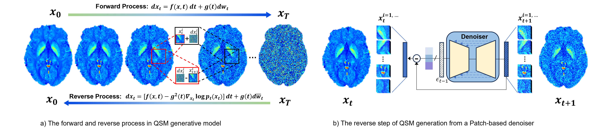

# Solving zero-shot inverse-problems for MRI susceptibility reconstruction from different measurements using diffusion models 

A unified framework for solving zero-shot inverse-problems for MRI susceptibility reconstruction from different measurements using diffusion models, including Super Resolution (SR),
Dipole Inversion (DipInv), the joint of Dipole Inversion and Super Resolution (DipInv+SR), and Single-step QSM from MRI raw phase.

The controllable generative process is achieved by X_0 domain projection from each iterative step of the reverse process.
This is a patch-based 3D image generation. To get rid of the boundary artifacts in-between patches, an overlapped generation strategy is adopted.

The code implementation is based on ADM published on NeurIPS https://proceedings.neurips.cc/paper_files/paper/2021/file/49ad23d1ec9fa4bd8d77d02681df5cfa-Paper.pdf

The idea of overlapped patch generation during sampling is inspired by the WeatherDiffusion work published on TPAMI https://doi.org/10.1109/TPAMI.2023.3238179

The model is trained on the 7T open-public multi-orientation dataset from https://doi.org/10.1016/j.neuroimage.2021.118326

##  Usage 

- For training, you will need to implement your own dataset by overriding the function path_composition in train.py

        python train.py

- For testing, please choose different inverse problems to perform by selecting the corresponding guiders, these include 'DipInv', 'SRDipInv', 'SR' for different tasks,
and the work for the single-step QSM is currently under investigation.

      python sample/sample.py
-

      some of the arguments are listed below:

        --task,           choice from 'DipInv', 'SRDipInv', 'SR' for different zero-shot inverse problems
        -g, --guidance,   guidance method choose from [dc, init]
        --ts,             threshold for DipInv only
        -w, --weight,     weight for data consistency
        --tv              weight for tv loss
        -i, --iter_num,   number of iterations for iterative optimization
        -s, --step_size,  step_size for iterative optimization